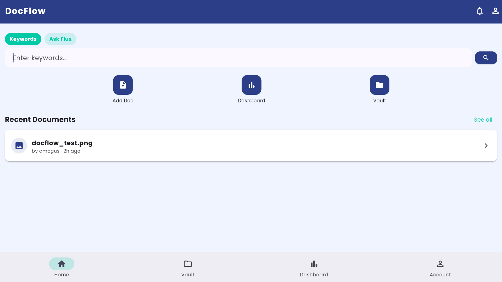

# DocFlow



> Intelligent document management powered by **Flux AI**


DocFlow is a cross-platform mobile application for intelligent multi-channel document ingestion and retrieval. It uses OCR, speech-to-text, and NLP to automatically extract, classify, and surface documents — with a live analytics dashboard and flexible tagging system.

---

## Features

| Feature | Description |
|---------|-------------|
| **Multi-format ingestion** | Upload PDFs, images (PNG/JPG) and audio (MP3) |
| **Automatic extraction** | OCR via Tesseract, transcription via Whisper |
| **TF-IDF keyword engine** | French NLP pipeline (spaCy + TF-IDF) for automatic tagging |
| **Flux AI search** | Ask questions in natural language or search by keyword |
| **Manual tags** | Add, remove and browse custom tags per document |
| **Dashboard** | Live stats: document count, version count, top keyword frequency chart |
| **Dark / Light mode** | System-aware theme with in-app toggle |
| **Version history** | Every upload revision tracked with timestamps |

---

## Project Structure

```
docflow/
├── README.md
├── back-end/
│   ├── app.py          Flask app — all API routes (Blueprint-based)
│   ├── schema.py       SQLAlchemy models: DocRecord, DocVersion
│   ├── init_db.py      Database initialization script
│   └── config.py       Cross-platform path configuration (Tesseract, FFmpeg)
└── front-end/
    ├── pubspec.yaml
    └── lib/
        ├── main.dart
        ├── config/
        │   ├── api_config.dart     API endpoint constants
        │   └── app_theme.dart      Light + dark ThemeData
        ├── providers/
        │   └── theme_provider.dart ChangeNotifier for dark/light toggle
        ├── screens/
        │   ├── launch_screen.dart  Animated splash screen
        │   ├── hub_screen.dart     Home with search + recent docs
        │   ├── vault_screen.dart   Filterable document list
        │   ├── doc_preview_screen.dart  Detail + manual tags + versions
        │   ├── dashboard_screen.dart    Stats + keyword frequency chart
        │   └── account_screen.dart     Profile + dark mode toggle
        └── widgets/
            ├── app_header.dart
            ├── nav_bar.dart         Material 3 NavigationBar (4 tabs)
            ├── smart_search_bar.dart  Keyword / Flux AI search modes
            ├── doc_card.dart
            ├── recent_docs_panel.dart  StreamBuilder-based live panel
            ├── toolbar_actions.dart
            ├── stats_card.dart
            ├── tag_chip.dart
            └── icon_action.dart
```

---

## Prerequisites

### Backend
- Python 3.7+
- [Tesseract OCR](https://github.com/tesseract-ocr/tesseract) with French language pack
- [FFmpeg](https://ffmpeg.org/download.html)

```bash
pip install flask flask-cors sqlalchemy pillow pytesseract PyMuPDF \
            openai-whisper scikit-learn torch torchaudio spacy
python -m spacy download fr_core_news_sm
```

Set environment variables to override default paths:
```bash
export TESSERACT_CMD=/usr/bin/tesseract
export FFMPEG_PATH=ffmpeg
export DATABASE_URL=sqlite:///db.sqlite3
```

### Frontend
- Flutter SDK `^3.7.2`
- Android SDK or iOS Simulator

```bash
cd front-end && flutter pub get
```

---

## Running DocFlow

```bash
# Terminal 1 — backend
cd back-end
python init_db.py       # first run only
python app.py

# Terminal 2 — Flutter app
cd front-end
flutter run
```

---

## API Reference

| Method | Endpoint | Description |
|--------|----------|-------------|
| `POST` | `/api/docs/ingest` | Upload and process a document |
| `GET` | `/api/docs/all` | List all documents with versions |
| `GET` | `/api/docs/versions?filename=X` | Get version history for a document |
| `GET` | `/api/docs/history?user=X` | Documents uploaded by a user |
| `POST` | `/api/docs/tags` | Set manual tags on a document |
| `POST` | `/api/search/query` | Natural language / Flux AI search |
| `POST` | `/api/search/keywords` | Direct keyword search |
| `GET` | `/api/stats` | Dashboard statistics |
| `POST` | `/api/assistant/compare` | Flux document comparison (stub) |

---

## Tech Stack

**Backend:** Python · Flask · SQLAlchemy · spaCy · scikit-learn (TF-IDF) · Whisper · Tesseract · PyMuPDF

**Frontend:** Flutter · Provider · Material 3 · Poppins · StreamBuilder

---

## Author

**Rayane Rousseau**
